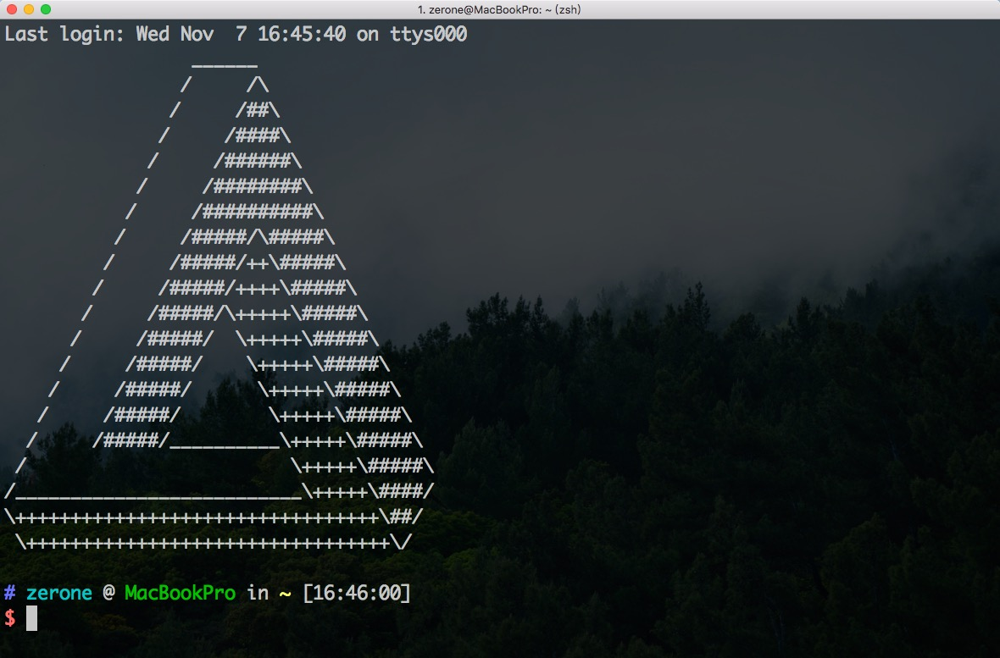

# macOS Configuration

## tools installation

``` bash
# 安装homebrew
$ /usr/bin/ruby -e "$(curl -fsSL https://raw.githubusercontent.com/Homebrew/install/master/install)"

$ brew install git
$ brew install wget
$ brew install node

# 使用cnpm代替npm
$ npm install -g cnpm --registry=https://registry.npm.taobao.org
```

## git

``` bash
$ git config --global user.name "fgksgf"
$ git config --global user.email "fgksgf@yahoo.com"
$ ssh-keygen -t rsa -b 4096 -C "fgksgf@yahoo.com"
```

## zsh

``` bash
# 安装oh-my-zsh
$ wget --no-check-certificate https://github.com/robbyrussell/oh-my-zsh/raw/master/tools/install.sh -O - | sh

# 安装自动提示与命令补全插件
$ git clone git://github.com/zsh-users/zsh-autosuggestions $ZSH_CUSTOM/plugins/zsh-autosuggestions

# 安装语法高亮插件
$ brew install zsh-syntax-highlighting

# 替换bash为zsh
$ chsh -s /bin/zsh

# 修改zsh配置文件
$ vim ~/.zshrc

################################################################
# 修改主题
ZSH_THEME="ys"

# 增加插件
plugins=(
	zsh-autosuggestions 
	git
)

# 增加命令别名
alias cls="clear"
alias gst="git status"
alias gadd="git add"
alias vps="ssh ubuntu@xxx.xxx.xxx.xxx"

# 关闭homebrew的自动更新
export HOMEBREW_NO_AUTO_UPDATE=true

# 实现终端走代理
export http_proxy="http://127.0.0.1:1087"
export https_proxy="http://127.0.0.1:1087"

# 开启语法高亮插件
source /usr/local/share/zsh-syntax-highlighting/zsh-syntax-highlighting.zsh
################################################################

# 加载.zshrc配置
$ source ~/.zshrc
```


## vim

```bash
$ vim ~/.vimrc

set nu
set ts=4
syntax on
set encoding=utf-8
set nocompatible
set autoindent
set cindent
set showmatch
set ignorecase
set hlsearch
set showcmd

" 启动显示状态行(1),总是显示状态行(2)
set laststatus=1
" 允许折叠
set foldenable
" 手动折叠
set foldmethod=manual
```

## 更改终端欢迎页

在 [这个网站](http://www.asciiworld.com/) 找到喜欢的图案，复制的到剪切板

```bash
$ cd /etc
$ sudo pico motd
```

粘贴图案，按`command + x`保存，接着按`y`确认，最后回车，重新打开一个终端窗口：



## tips

1. 安装`NewFileMenuFree`软件，增加右键新建文件选项
2. 剪切：`command + c` 复制文件，`command + alt + v` 粘贴实现文件的移动。

## 快捷键

+ Ctrl + A：到行首（达到Home键的效果）
+ Ctrl + E：到行尾（达到End键的效果）
+ Ctrl + N：到下一行
+ Ctrl + P：到上一行
+ Ctrl + K：从光标处开始删除，直到行尾
+ Ctrl + command + Q：锁定屏幕（与QQ快捷键冲突，需要设置QQ）