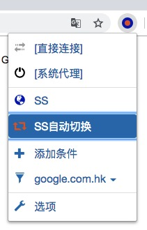
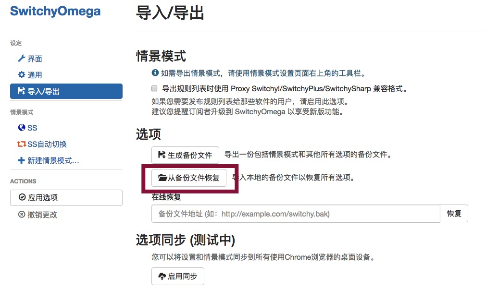

# 必备工具配置

## Chrome浏览器梯子插件配置

1. 将chrome目录下的`SwitchyOmega.crx`文件拖动至`Chrome`浏览器窗口，以安装该扩展程序。

2. 在浏览器右上角点击该扩展程序图标 => 选项。


3. 点击导入/导出 => 从备份文件恢复，选择chrome目录下的`OmegaOptions.bak`文件。



## Sublime Text 3 配置

### 安装插件

+ Package Control
+ Emmet
+ Themes
+ Color Scheme

### 基本设置

```json
{
	"color_scheme": "Packages/Color Scheme - Default/Mariana.sublime-color-scheme",
	"font_face": "Monaco",
	"font_size": 20,
	"highlight_line": true,
	"ignored_packages":
	[
	],
	"save_on_focus_lost": true,
	"show_encoding": true,
	"show_line_endings": true,
	"theme": "Elementary Dark.sublime-theme",
	"translate_tabs_to_spaces": true
}
```

### 按键设置

```json
[
	{ "keys": ["super+d"], "command": "duplicate_line" },
	{ "keys": ["super+y"], "command": "run_macro_file", "args": {"file": "res://Packages/Default/Delete Line.sublime-macro"} }
]

```

